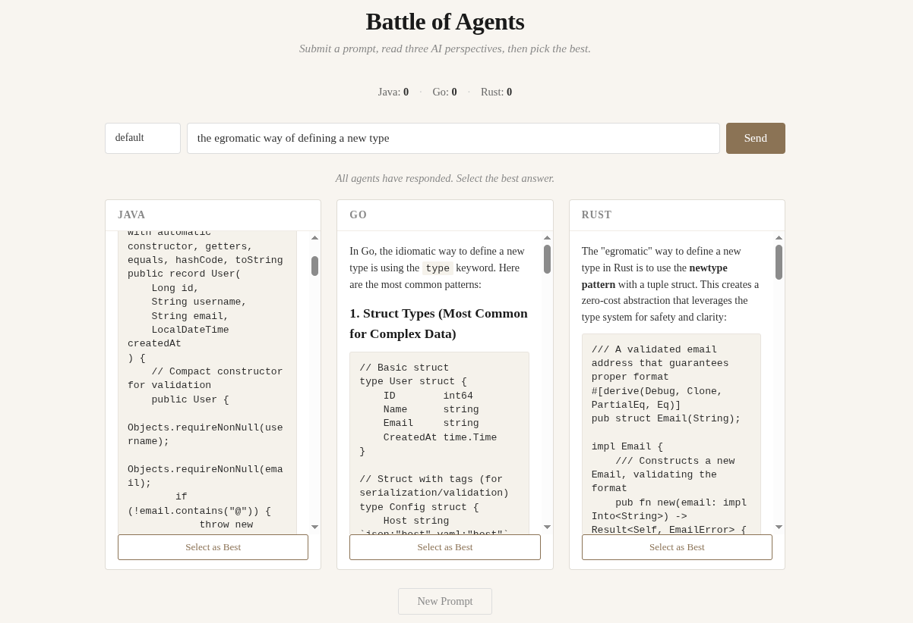
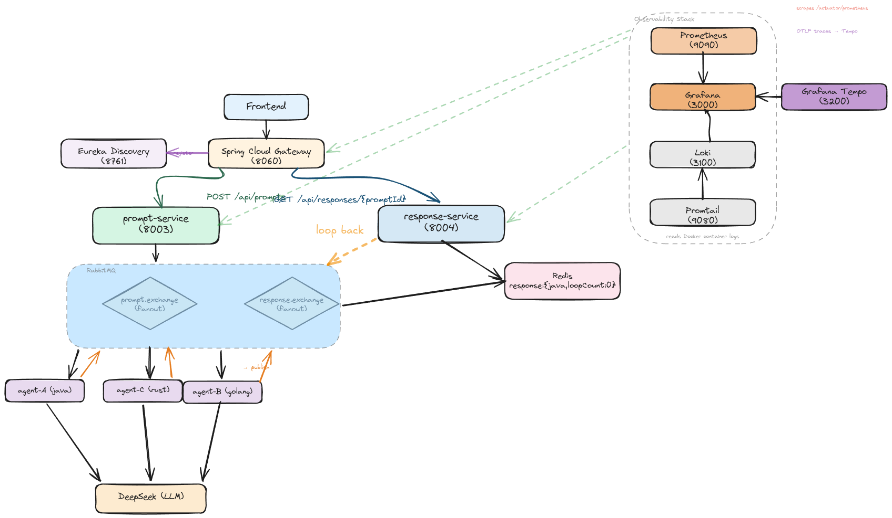

# agents-battel

microservice arch project, that separate the deployment form the volume(state) and keeps the arch scalabel as much as possible.
solving non-byzantine issues, and covering the fundmental battle between languges.i used the cheapest model outhere(i am borke tbh).
you are open to fork and make your own oc(but mention me ;)
 
<p align="center">
  
</p>

as a local first advocate, the setup is quite simple 
## local start as always
```bash
echo "DEEPSEEK_API_KEY=sk-..." > .env
docker compose up --build
```

Open http://localhost:8080. and enjoy the game

## Arch 
<p align="center">
  
</p>

## Agent configuration

Each agent loads a YAML config mounted,  remember to include **make no mistake** `AGENT_CONFIG_PATH`:

```yaml
agent:
  type: java
  system-prompt: |
    You are a senior Java developer with expert knowledge of Spring Boot, Hibernate,
    Jakarta EE, and JVM internals. Think in terms of object-oriented design...
  model: deepseek-chat
  temperature: 0.2
  max-tokens: 1000
```

Built-in configs in `configs/`:

| Agent | File | Personality |
|---|---|---|
| Java | `configs/agent-java.yml` | OOP, Spring Boot, JVM internals, production-ready code |
| Go | `configs/agent-golang.yml` | Goroutines, channels, composition, stdlib, minimalism |
| Rust | `configs/agent-rust.yml` | Ownership, lifetimes, zero-cost abstractions, safety |

Add a new agent: create a config file, add a service block in `docker-compose.yml` or a ConfigMap + Deployment in `k8s/`.

## Services

| Service | Port | Role |
|-----------|------|------|
| discovery-service | 8761 | Eureka service registry |
| gateway-service | 8060 | Spring Cloud Gateway (routes via Eureka) |
| prompt-service | 8003 | REST entry point, publishes to `prompt.exchange` |
| response-service | 8004 | Consumes `response.exchange`, Redis CRUD, GET endpoint |
| agent-service | 8005 | Message-driven, calls DeepSeek API, publishes result |
| frontend | 8080 | Nginx reverse proxy → gateway-service |
| prometheus | 9090 | Metrics collection (scrapes `/actuator/prometheus`) |
| grafana | 3000 | Dashboards (Prometheus + Loki + Tempo datasources) |
| tempo | 3200 / 4318 | Distributed trace storage (receives OTLP) |
| loki | 3100 | Centralized log aggregation |
| rabbitmq | 5672 / 15672 | Message broker / Management UI |
| redis | 6379 | Response cache (`HSET`/`HGETALL`, immutable history `java:0`, `java:1`, ...) |

## Environment variables

| Variable | Required | Default | Used by |
|---|---|---|---|
| `DEEPSEEK_API_KEY` | yes | — | agent-service (DeepSeek auth) |
| `RABBITMQ_HOST` | no | localhost | all services |
| `REDIS_HOST` | no | localhost | response-service |
| `AGENT_TYPE` | yes | — | agent-service (group name, must match config) |
| `AGENT_CONFIG_PATH` | no | /etc/agent/agent.yml | agent-service |
| `EUREKA_CLIENT_SERVICEURL_DEFAULTZONE` | no | http://localhost:8761/eureka/ | all services |
| `APP_MAX_LOOPS` | no | 2 | response-service (refinement rounds) |
| `APP_AGENT_TYPES` | no | java,golang,rust | response-service (expected agents) |

## Monitoring & Tracing

All Spring Boot services expose `/actuator/prometheus` for Prometheus scraping
and send **distributed traces** via OTLP to Grafana Tempo.

- **Prometheus** → http://localhost:9090
- **Grafana** → http://localhost:3000 (admin/admin)
- **Tempo** → OTLP on `:4318`, query traces from Grafana
- **Loki** → http://localhost:3100 (log queries from Grafana)

Promtail reads Docker container logs and ships them to Loki.
Grafana comes pre-configured with Prometheus, Loki, and Tempo datasources.

### Trace flow

```
Browser → Gateway → prompt-service → RabbitMQ → agent-service → DeepSeek
         ↓           ↓                 ↓           ↓
         └────────────────────── OTLP ──────────────────────→ Tempo → Grafana
```

Traces propagate automatically through HTTP headers (`traceparent`) and
RabbitMQ message headers. Every service hop appears as a span in the waterfall.
Log lines carry `trace_id` for correlation.

## Prompt Looping

Agents refine their answers through iterative rounds. After all agents respond, their answers are fed back as context for a refinement round.

**Flow**:

```
User → prompt-service → prompt.exchange → agents (loop 0)
                                            ↓
                                     response.exchange
                                            ↓
                                  response-service (stores java:0, golang:0, rust:0)
                                            ↓
                              loop-back: publishes to prompt.exchange
                              with previousResponses {java, golang, rust}
                                            ↓
                                  agents refine (loop 1)
                                            ↓
                                     response.exchange
                                            ↓
                                  response-service (stores java:1, golang:1, rust:1)
                                            ↓
                                  frontend: done = true
```

- Responses are **immutable** — each loop creates a new Redis field (`java:0`, `java:1`, …)
- `app.max-loops=2` means 1 initial + 1 refinement (configurable)
- The loop-back bypasses prompt-service — response-service publishes directly to `prompt.exchange`

## Deployment

### Docker Compose (dev)

```bash
docker compose up --build
```

### Kubernetes (k8s)

```bash
kubectl apply -k k8s/
```

Requires a Secret with `deepseek-api-key`:

```bash
kubectl create secret generic deepseek-api-key --from-literal=api-key=sk-... -n prompts
```
